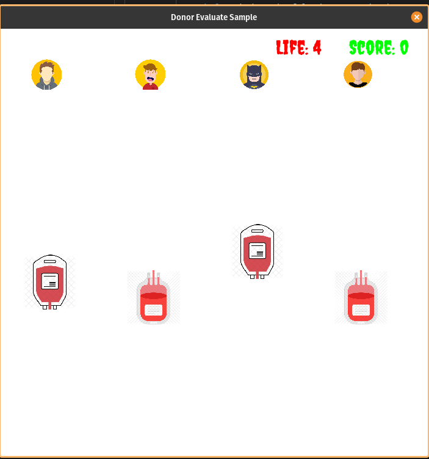

# Donor Evaluate Sample (Uncaught Exception Hackathon 01)

Simple game that requires the player to "evaluate" the click the blood "sample" from the "donor"
that was displayed when the game starts

[Hackathon Live Stream](https://www.youtube.com/watch?v=Bodi4Zi8u08)
[Demo](https://youtu.be/Bodi4Zi8u08?t=10507)

